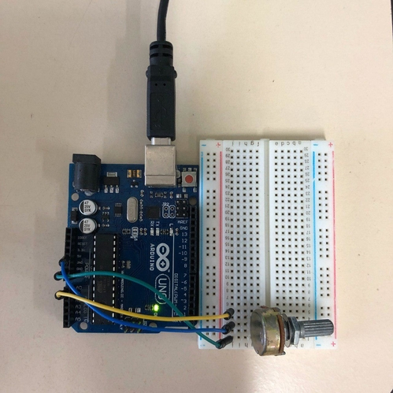

# Datalogger for ATMega328

Work for the lecture Microprocessor Systems ENGC50 from Federal University of Bahia.

Implementation of a Data Logger using C++ and Python to retrieve the data from sensors (ADC) from ATMega328.

## Installation

The program was mainly designed for Linux, an adaptation is welcome for Windows. We used Python3.5 and the needed packages to work are:

`$ pip3.5 install pyserial`

`$ pip3.5 install matplotlib`

`$ sudo apt-get install python3.5-tk`

## Tested setup

We used the following setup:

Upload the code from `/src/uCInterface.ino` to your Arduino using Arduino IDE, command line or any other IDE as you wish.

After uploading run the Python program:

`$ python3.5 graphicalInterface.py `

## Authors

- **Mauricio Taffarel** - [taffarel55](https://github.com/taffarel55)
- **Henrique Poleselo** - [hpoleselo](https://github.com/hpoleselo)

## Professor

**Paulo Cesar Farias** - [pcmaf](https://github.com/pcmaf)
